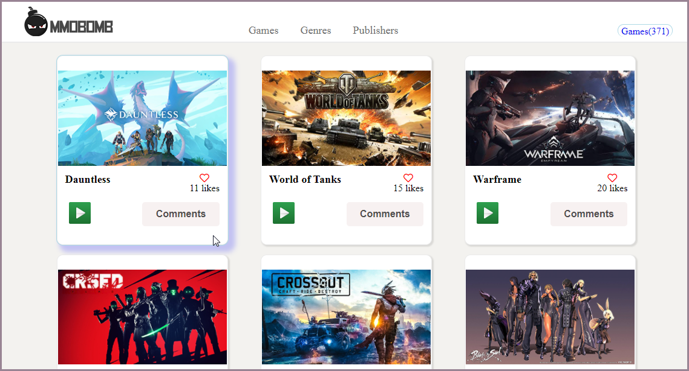
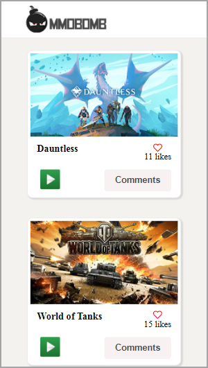

# MMO Games 

## Description

> MMO Games is a web app, built using vanilla JavaScript, Webpack and ES6 features, notably modules. The project consumes data from the mmo games API using JavaScript async and await fetchAPI. It is [live here](https://mmo-games.netlify.app/) for a demo of the project. The user is able to see a list of games. The user is also able to post comments using the InvolvementAPI and view all other comments posted by other users. 

- Desktop Screenshot 

- Mobile Screenshot 

## Built With

This project is build with:

- HTML
- CSS
- Vanilla Javascript
- Webpack
- Dot-env for environment variables 

## Getting Started

If you want to run the project locally in your browser you need to install: 

  - Node
  - Npm (Node Package Manager)
  - Git
  - Text Editor

To get the content of this project locally you need to run this command in your terminal:

- ` git clone https://github.com/gtekle/mmo-games.git`

You need to then install the packages locally to your system by running: 

 > npm install 

To start the server in development mode, Run: 

 > npm run dev 

## Test

For tracking linter errors locally you need to follow these steps:

- For tracking the linter errors in HTML files run:

  > npx hint .

- And for tracking the linter errors in CSS files run:

  > npx stylelint "**/*.css"

- And for tracking the linter errors in JS files run:

  > npx eslint .

- To run tests (project uses the [Jest](https://jestjs.io/) framework) you can run the following npm script in your command line:

  > npx run test

## 👤 Author

👤 **Alick Nyirenda**
- GitHub: [@githubhandle](https://github.com/Beardless-sheik)
- Twitter: [@twitterhandle](https://twitter.com/Beardless_Sheik)
- LinkedIn: [LinkedIn](https://www.linkedin.com/in/alick-nyirenda/)

👤 **Tekle Gebreyohannes**
- GitHub: [@gtekle](https://github.com/gtekle)
- Twitter: [@teklegyohannes](https://twitter.com/teklegyohannes)
- LinkedIn: [LinkedIn](https://www.linkedin.com/in/tekle-gebreyohannes-kidanemariam-7605752b)

## Contributing

Feel free to check the [issues page](https://github.com/Beardless-sheik/AwesomeBooks/issues) for comments and please offer any contributions!

## Show your support

Give a :star: if you like this project!

## Acknowledgments

- Thanks to [Microverse](www.microverse.org) team that helped with project guidelines
- Thanks to [RapidAPI & MMO Games List]() for their use of the free games API.

